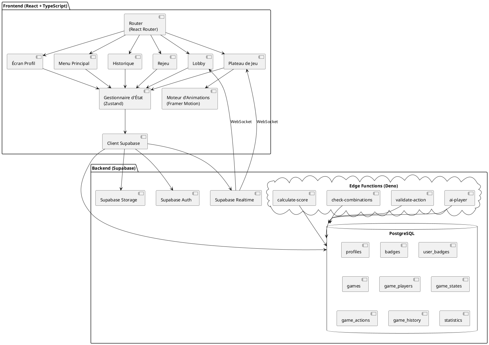
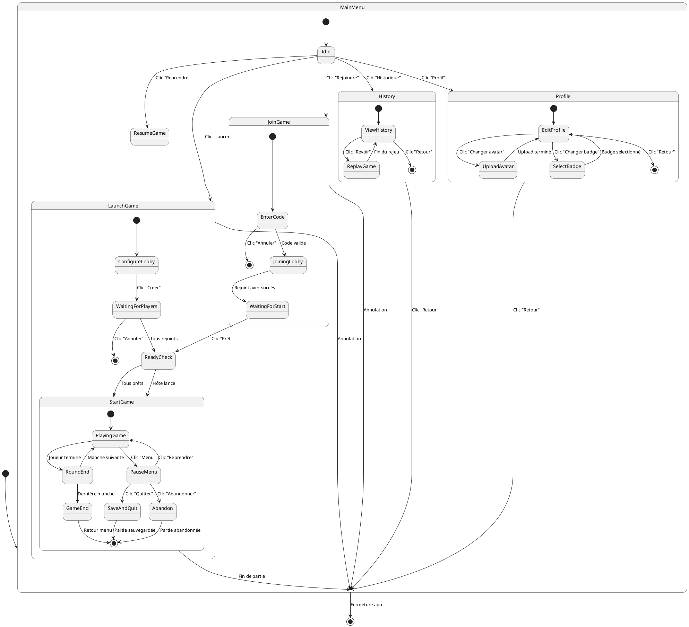
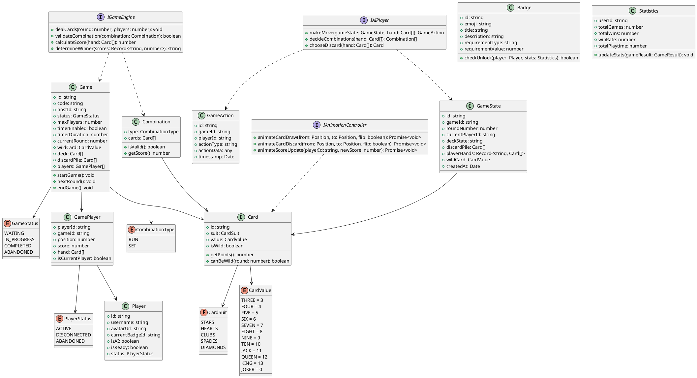
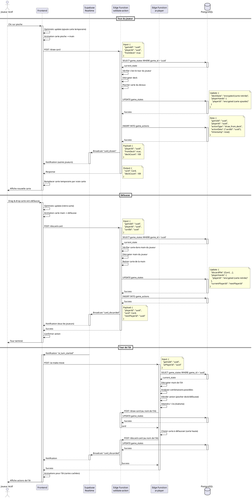
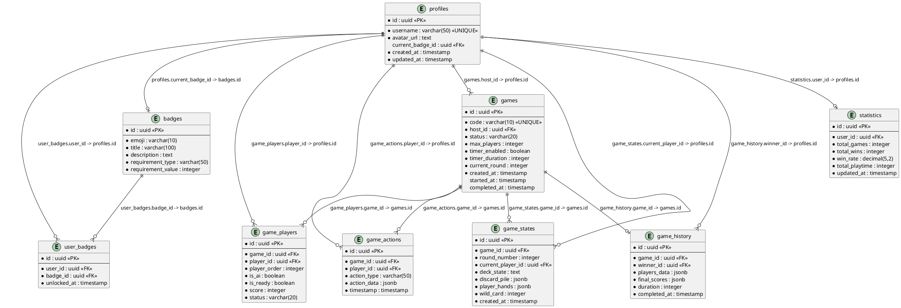
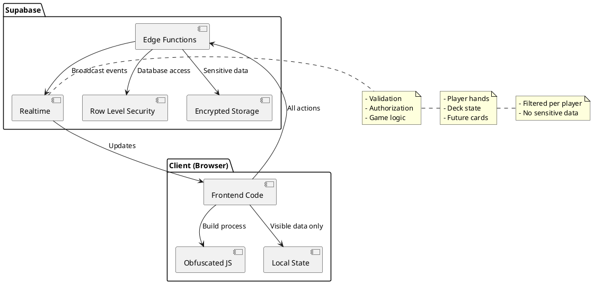

# Document de Conception Système
# Les Cinq Rois - Jeu en Ligne

**Version** : 1.0  
**Date** : 07/11/2025  
**Architecte** : Bob  
**to update**

---

## 1. Approche d'Implémentation

Nous allons développer une application web multijoueur en temps réel basée sur une architecture client-serveur moderne avec les choix technologiques suivants :

### 1.1 Stack Technique

**Frontend**
- **Framework** : React 18+ avec TypeScript pour la type-safety
- **UI Components** : Shadcn-ui pour des composants accessibles et personnalisables
- **Styling** : Tailwind CSS pour un design responsive et cohérent
- **Animations** : 
  - animate.css pour les animations prédéfinies (lobby, notifications)
  - Framer Motion pour les animations de cartes personnalisées et fluides
- **State Management** : Zustand (léger et performant pour les jeux en temps réel)
- **Routing** : React Router v6
- **Build Tool** : Vite pour des builds rapides et HMR performant

**Backend (Supabase)**
- **Base de données** : PostgreSQL avec extensions pour JSONB et cryptographie
- **Authentification** : Supabase Auth (anonymous + email optionnel)
- **Temps réel** : Supabase Realtime avec WebSockets
- **Stockage** : Supabase Storage pour les avatars
- **Edge Functions** : Deno pour la logique serveur (validation, IA, scoring)
- **Sécurité** : Row Level Security (RLS) policies

### 1.2 Défis Techniques et Solutions

**Défi 1 : Synchronisation temps réel sans latence visible**
- **Solution** : Utiliser Supabase Realtime avec optimistic updates côté client
- **Implémentation** : Les actions sont appliquées immédiatement localement, puis confirmées par le serveur

**Défi 2 : Sécurité anti-triche (empêcher l'inspection des cartes)**
- **Solution** : Architecture "server-authoritative"
  - Les mains des joueurs sont stockées chiffrées côté serveur
  - Le client ne reçoit que ses propres cartes
  - Toutes les actions sont validées par Edge Functions
  - Obfuscation du code en production

**Défi 3 : Animations fluides pour 8 joueurs simultanés**
- **Solution** : 
  - Utiliser Framer Motion avec layout animations
  - Limiter les re-renders avec React.memo et useMemo
  - Animations CSS pour les éléments simples (plus performant)
  - Queue d'animations pour éviter les conflits

**Défi 4 : Gestion des déconnexions**
- **Solution** :
  - Heartbeat toutes les 5 secondes
  - Sauvegarde automatique de l'état du jeu toutes les 30 secondes
  - Reconnexion automatique avec restauration de l'état
  - Timer de grâce de 60 secondes avant de remplacer par IA

**Défi 5 : Logique d'IA performante**
- **Solution** :
  - Algorithme heuristique simple mais efficace
  - Exécution dans une Edge Function séparée
  - Temps de "réflexion" artificiel pour le réalisme (1-3 secondes)

### 1.3 Bibliothèques Open Source

- **@supabase/supabase-js** : Client Supabase officiel
- **framer-motion** : Animations React performantes
- **zustand** : State management minimaliste
- **react-router-dom** : Routing
- **animate.css** : Animations CSS prêtes à l'emploi
- **lucide-react** : Icônes SVG optimisées
- **date-fns** : Manipulation de dates
- **zod** : Validation de schémas TypeScript

---

## 2. Interactions Utilisateur et UI

### 2.1 Parcours Utilisateur Principal

**Nouveau Joueur**
1. Arrive sur le menu principal
2. Clique sur "⚙️ Profil" pour configurer pseudo et avatar
3. Sélectionne un badge par défaut (🏆 Premier Pas)
4. Retourne au menu et clique sur "🎮 Lancer une partie"
5. Configure la partie (nombre de joueurs, timer)
6. Attend que d'autres joueurs rejoignent ou lance avec IA
7. Joue la partie avec animations fluides
8. Consulte ses statistiques et badges débloqués

**Joueur Récurrent**
1. Arrive sur le menu principal
2. Clique sur "🔗 Rejoindre une partie"
3. Entre le code de partie partagé par un ami
4. Se met "prêt" dans le lobby
5. Joue la partie
6. Consulte l'historique et rejoue des parties intéressantes

### 2.2 Interactions Clés par Écran

**Menu Principal**
- Clic sur "Lancer une partie" → Navigation vers écran de configuration
- Clic sur "Rejoindre une partie" → Modal avec input pour code de partie
- Clic sur "Reprendre une partie" → Liste des parties sauvegardées (IA uniquement)
- Clic sur "Historique" → Navigation vers écran d'historique
- Clic sur icône "⚙️" → Navigation vers écran de profil

**Écran de Profil**
- Upload d'avatar → Crop et preview avant sauvegarde
- Modification du pseudo → Validation en temps réel (unicité, longueur)
- Sélection de badge → Dropdown avec badges débloqués en haut
- Affichage de la progression des badges → Barre de progression pour chaque badge

**Lobby de Jeu**
- Hôte : Sélection nombre de joueurs → Dropdown (2-8)
- Hôte : Toggle timer → Active/désactive avec sélection de durée
- Joueur : Bouton "Prêt" → Animation de changement de couleur du pseudo
- Hôte : Bouton "Lancer" → Activé uniquement si tous prêts, popup si joueurs manquants
- Tous : Affichage en temps réel des joueurs qui rejoignent → Animation + notification

**Plateau de Jeu**
- Clic sur pioche → Animation de carte vers la main + retournement
- Clic sur défausse → Pioche la carte du dessus
- Drag & drop carte → Vers zone de défausse
- Clic sur "Terminer la manche" → Validation des combinaisons, calcul du score
- Timer visible → Compte à rebours avec changement de couleur (vert → orange → rouge)
- Menu pause → Options : Quitter (sauvegarde), Abandonner, Reprendre

**Historique**
- Clic sur "▶️ Revoir" → Navigation vers écran de rejeu
- Scroll infini → Charge plus de parties au scroll
- Filtres → Par date, résultat, nombre de joueurs

**Rejeu de Partie**
- Contrôles de lecture → Play/Pause, vitesse (0.5x, 1x, 2x, 5x)
- Timeline interactive → Clic pour sauter à un moment précis
- Affichage synchronisé → État du jeu à chaque instant

### 2.3 Feedback Visuel et Animations

**Animations de Cartes (Framer Motion)**
```typescript
// Pioche vers main (joueur actif)
- Position initiale : deck
- Position finale : main du joueur
- Rotation : 180° (flip)
- Durée : 0.5s
- Easing : easeInOut

// Défausse (joueur actif)
- Position initiale : main
- Position finale : discard pile
- Rotation : 0°
- Durée : 0.3s
- Easing : easeOut

// Pioche vers main (autres joueurs)
- Position initiale : deck
- Position finale : zone du joueur
- Rotation : 0° (reste cachée)
- Durée : 0.5s
- Easing : easeInOut
```

**Animations du Lobby (animate.css)**
```css
/* Entrée slot d'attente */
.waiting-slot-enter {
  animation: lightSpeedInLeft 0.5s;
}

/* Sortie slot d'attente */
.waiting-slot-exit {
  animation: hinge 2.5s;
}

/* Changement de statut "prêt" */
.ready-status {
  background: linear-gradient(to right, red 0%, green 100%);
  animation: slideColorChange 0.5s forwards;
}
```

**Notifications**
- Position : Top-right corner
- Animation d'entrée : slideInRight (0.3s)
- Durée d'affichage : 3 secondes
- Animation de sortie : fadeOut (0.3s)

---

## 3. Architecture Système

### 3.1 Diagramme d'Architecture Globale



### 3.2 Architecture Frontend Détaillée

**Structure des Composants**

```
src/
├── components/
│   ├── ui/                    # Shadcn-ui components
│   │   ├── button.tsx
│   │   ├── card.tsx
│   │   ├── dialog.tsx
│   │   ├── dropdown.tsx
│   │   └── ...
│   ├── game/
│   │   ├── Card.tsx           # Composant carte individuelle
│   │   ├── Deck.tsx           # Pioche
│   │   ├── DiscardPile.tsx    # Défausse
│   │   ├── PlayerHand.tsx     # Main d'un joueur
│   │   ├── GameBoard.tsx      # Plateau principal
│   │   ├── ScoreBoard.tsx     # Tableau des scores
│   │   └── Timer.tsx          # Compte à rebours
│   ├── lobby/
│   │   ├── PlayerSlot.tsx     # Slot joueur dans le lobby
│   │   ├── WaitingSlot.tsx    # Slot d'attente animé
│   │   ├── LobbySettings.tsx  # Configuration de partie
│   │   └── ReadyButton.tsx    # Bouton prêt
│   ├── profile/
│   │   ├── AvatarUpload.tsx   # Upload d'avatar
│   │   ├── BadgeSelector.tsx  # Sélection de badge
│   │   └── BadgeGrid.tsx      # Grille de badges
│   ├── history/
│   │   ├── GameList.tsx       # Liste des parties
│   │   ├── GameCard.tsx       # Carte de partie
│   │   └── Statistics.tsx     # Statistiques globales
│   ├── replay/
│   │   ├── ReplayControls.tsx # Contrôles de lecture
│   │   ├── Timeline.tsx       # Timeline interactive
│   │   └── SpeedSelector.tsx  # Sélection de vitesse
│   └── common/
│       ├── Notification.tsx   # Toast notifications
│       ├── LoadingSpinner.tsx
│       └── ErrorBoundary.tsx
├── pages/
│   ├── MainMenu.tsx
│   ├── ProfilePage.tsx
│   ├── LobbyPage.tsx
│   ├── GamePage.tsx
│   ├── HistoryPage.tsx
│   └── ReplayPage.tsx
├── stores/
│   ├── gameStore.ts           # État du jeu (Zustand)
│   ├── profileStore.ts        # Profil utilisateur
│   ├── lobbyStore.ts          # État du lobby
│   └── historyStore.ts        # Historique
├── lib/
│   ├── supabase.ts            # Client Supabase
│   ├── gameLogic.ts           # Logique de jeu
│   ├── cardUtils.ts           # Utilitaires cartes
│   ├── animationUtils.ts      # Utilitaires animations
│   └── validationUtils.ts     # Validations
├── hooks/
│   ├── useGame.ts             # Hook pour le jeu
│   ├── useRealtime.ts         # Hook pour Realtime
│   ├── useAuth.ts             # Hook pour Auth
│   └── useAnimations.ts       # Hook pour animations
├── types/
│   ├── game.types.ts
│   ├── player.types.ts
│   ├── card.types.ts
│   └── database.types.ts      # Types générés par Supabase
└── constants/
    ├── gameRules.ts           # Règles du jeu
    ├── badges.ts              # Définition des badges
    └── animations.ts          # Configurations animations
```

**Gestion d'État avec Zustand**

```typescript
// stores/gameStore.ts
interface GameState {
  // État du jeu
  gameId: string | null;
  currentRound: number;
  currentPlayerId: string | null;
  players: Player[];
  myHand: Card[];
  deck: number; // Nombre de cartes restantes
  discardPile: Card[];
  wildCard: CardValue;
  scores: Record<string, number>;
  
  // Actions
  drawCard: (fromDeck: boolean) => Promise<void>;
  discardCard: (card: Card) => Promise<void>;
  finishRound: (combinations: Combination[]) => Promise<void>;
  
  // Realtime sync
  subscribeToGame: (gameId: string) => void;
  unsubscribeFromGame: () => void;
}

// stores/profileStore.ts
interface ProfileState {
  profile: Profile | null;
  badges: Badge[];
  unlockedBadges: string[];
  statistics: Statistics;
  
  updateProfile: (data: Partial<Profile>) => Promise<void>;
  uploadAvatar: (file: File) => Promise<string>;
  selectBadge: (badgeId: string) => Promise<void>;
  checkBadgeUnlocks: () => Promise<void>;
}
```

---

## 4. Navigation et Flux UI

### 4.1 Diagramme de Navigation (State Machine)



### 4.2 Profondeur de Navigation

**Niveau 1 : Menu Principal** (Point d'entrée)
- Lancer une partie
- Rejoindre une partie
- Reprendre une partie
- Historique
- Profil

**Niveau 2 : Écrans Principaux**
- Lobby (depuis Lancer/Rejoindre)
- Jeu (depuis Lobby)
- Historique (liste des parties)
- Profil (configuration)

**Niveau 3 : Écrans Secondaires**
- Rejeu (depuis Historique)
- Pause Menu (depuis Jeu)
- Sélection de badge (depuis Profil)

**Navigation Retour**
- Bouton "← Retour" toujours visible en haut à gauche
- Breadcrumb pour les niveaux 3+
- Raccourci clavier : Échap pour revenir en arrière

---

## 5. Structures de Données et Interfaces

### 5.1 Diagramme de Classes



### 5.2 Types TypeScript Détaillés

```typescript
// types/card.types.ts
export enum CardSuit {
  STARS = 'stars',
  HEARTS = 'hearts',
  CLUBS = 'clubs',
  SPADES = 'spades',
  DIAMONDS = 'diamonds'
}

export enum CardValue {
  THREE = 3,
  FOUR = 4,
  FIVE = 5,
  SIX = 6,
  SEVEN = 7,
  EIGHT = 8,
  NINE = 9,
  TEN = 10,
  JACK = 11,
  QUEEN = 12,
  KING = 13,
  JOKER = 0
}

export interface Card {
  id: string;
  suit: CardSuit;
  value: CardValue;
  isWild: boolean;
}

export enum CombinationType {
  RUN = 'run',
  SET = 'set'
}

export interface Combination {
  type: CombinationType;
  cards: Card[];
}

// types/game.types.ts
export enum GameStatus {
  WAITING = 'waiting',
  IN_PROGRESS = 'in_progress',
  COMPLETED = 'completed',
  ABANDONED = 'abandoned'
}

export interface Game {
  id: string;
  code: string;
  hostId: string;
  status: GameStatus;
  maxPlayers: number;
  timerEnabled: boolean;
  timerDuration: number;
  currentRound: number;
  wildCard: CardValue;
  createdAt: Date;
  startedAt: Date | null;
  completedAt: Date | null;
}

export interface GameState {
  id: string;
  gameId: string;
  roundNumber: number;
  currentPlayerId: string;
  deckState: string; // Encrypted
  discardPile: Card[];
  playerHands: Record<string, string>; // Encrypted
  wildCard: CardValue;
  createdAt: Date;
}

export enum ActionType {
  DRAW_FROM_DECK = 'draw_from_deck',
  DRAW_FROM_DISCARD = 'draw_from_discard',
  DISCARD = 'discard',
  FINISH_ROUND = 'finish_round'
}

export interface GameAction {
  id: string;
  gameId: string;
  playerId: string;
  actionType: ActionType;
  actionData: any;
  timestamp: Date;
}

// types/player.types.ts
export enum PlayerStatus {
  ACTIVE = 'active',
  DISCONNECTED = 'disconnected',
  ABANDONED = 'abandoned'
}

export interface Player {
  id: string;
  username: string;
  avatarUrl: string;
  currentBadgeId: string;
  createdAt: Date;
  updatedAt: Date;
}

export interface GamePlayer {
  id: string;
  gameId: string;
  playerId: string;
  playerOrder: number;
  isAI: boolean;
  isReady: boolean;
  score: number;
  status: PlayerStatus;
}

// types/badge.types.ts
export enum BadgeRequirementType {
  TOTAL_WINS = 'total_wins',
  TOTAL_GAMES = 'total_games',
  WIN_STREAK = 'win_streak',
  LOW_SCORE = 'low_score',
  PERFECT_ROUND = 'perfect_round',
  SPECIAL_ACTION = 'special_action'
}

export interface Badge {
  id: string;
  emoji: string;
  title: string;
  description: string;
  requirementType: BadgeRequirementType;
  requirementValue: number;
}

export interface UserBadge {
  id: string;
  userId: string;
  badgeId: string;
  unlockedAt: Date;
}

// types/statistics.types.ts
export interface Statistics {
  id: string;
  userId: string;
  totalGames: number;
  totalWins: number;
  winRate: number;
  totalPlaytime: number; // en secondes
  updatedAt: Date;
}
```

---

## 6. Flux de Programme (Diagramme de Séquence)

### 6.1 Création et Lancement d'une Partie

```plantuml
@startuml
actor "Hôte" as Host
participant "Frontend\n(React)" as Frontend
participant "Supabase\nRealtime" as Realtime
participant "Edge Function\nvalidate-game" as ValidateGame
database "PostgreSQL" as DB

== Création de la Partie ==

Host -> Frontend: Clic "Lancer une partie"
activate Frontend

Frontend -> Frontend: Navigation vers LobbyPage
Frontend -> ValidateGame: POST /create-game
activate ValidateGame
note right
  Input: {
    "hostId": "uuid",
    "maxPlayers": 4,
    "timerEnabled": true,
    "timerDuration": 30
  }
end note

ValidateGame -> DB: INSERT INTO games
activate DB
DB --> ValidateGame: game_id, code
deactivate DB

ValidateGame -> DB: INSERT INTO game_players (host)
activate DB
DB --> ValidateGame: Success
deactivate DB

ValidateGame --> Frontend: Response
deactivate ValidateGame
note right
  Output: {
    "gameId": "uuid",
    "code": "ABC123",
    "status": "waiting"
  }
end note

Frontend -> Realtime: Subscribe to channel "game:ABC123"
activate Realtime
Realtime --> Frontend: Subscribed
deactivate Realtime

Frontend -> Host: Affiche lobby avec code ABC123
deactivate Frontend

== Joueur Rejoint ==

actor "Joueur 2" as Player2
Player2 -> Frontend: Entre code "ABC123"
activate Frontend

Frontend -> ValidateGame: POST /join-game
activate ValidateGame
note right
  Input: {
    "gameCode": "ABC123",
    "playerId": "uuid"
  }
end note

ValidateGame -> DB: SELECT game WHERE code = 'ABC123'
activate DB
DB --> ValidateGame: game_data
deactivate DB

ValidateGame -> DB: INSERT INTO game_players
activate DB
DB --> ValidateGame: Success
deactivate DB

ValidateGame -> Realtime: Broadcast "player_joined"
activate Realtime
note right
  Payload: {
    "playerId": "uuid",
    "username": "Player2",
    "avatarUrl": "...",
    "badgeEmoji": "🎯"
  }
end note

Realtime --> Frontend: Notification (tous les clients)
deactivate Realtime

ValidateGame --> Frontend: Success
deactivate ValidateGame

Frontend -> Player2: Affiche lobby
Frontend -> Host: Notification "Player2 a rejoint"
deactivate Frontend

== Mise en "Prêt" ==

Player2 -> Frontend: Clic "Prêt"
activate Frontend

Frontend -> DB: UPDATE game_players SET is_ready = true
activate DB
DB --> Frontend: Success
deactivate DB

Frontend -> Realtime: Broadcast "player_ready"
activate Realtime
note right
  Payload: {
    "playerId": "uuid",
    "isReady": true
  }
end note

Realtime --> Frontend: Notification (tous les clients)
deactivate Realtime

Frontend -> Frontend: Animation changement couleur pseudo
Frontend -> Host: Active bouton "Lancer"
deactivate Frontend

== Lancement de la Partie ==

Host -> Frontend: Clic "Lancer la partie"
activate Frontend

Frontend -> ValidateGame: POST /start-game
activate ValidateGame
note right
  Input: {
    "gameId": "uuid"
  }
end note

ValidateGame -> DB: SELECT game_players WHERE game_id = 'uuid'
activate DB
DB --> ValidateGame: players_list
deactivate DB

ValidateGame -> ValidateGame: Vérifier tous prêts
ValidateGame -> ValidateGame: Ajouter IA si nécessaire

ValidateGame -> DB: UPDATE games SET status = 'in_progress'
activate DB
DB --> ValidateGame: Success
deactivate DB

ValidateGame -> ValidateGame: Initialiser deck (116 cartes)
ValidateGame -> ValidateGame: Mélanger deck
ValidateGame -> ValidateGame: Distribuer cartes (round 1 = 3 cartes)

ValidateGame -> DB: INSERT INTO game_states
activate DB
note right
  Data: {
    "gameId": "uuid",
    "roundNumber": 1,
    "currentPlayerId": "uuid",
    "deckState": "encrypted",
    "discardPile": [topCard],
    "playerHands": {
      "player1": "encrypted",
      "player2": "encrypted"
    },
    "wildCard": 3
  }
end note
DB --> ValidateGame: Success
deactivate DB

ValidateGame -> Realtime: Broadcast "game_started"
activate Realtime
note right
  Payload: {
    "gameId": "uuid",
    "roundNumber": 1,
    "wildCard": 3,
    "currentPlayerId": "uuid",
    "discardPileTop": Card
  }
end note

Realtime --> Frontend: Notification (tous les clients)
deactivate Realtime

ValidateGame --> Frontend: Success
deactivate ValidateGame
note right
  Output: {
    "gameState": {
      "myHand": [Card, Card, Card],
      "deckCount": 110,
      "discardPile": [Card],
      "currentPlayer": "uuid"
    }
  }
end note

Frontend -> Frontend: Navigation vers GamePage
Frontend -> Frontend: Affiche plateau de jeu
Frontend -> Host: Affiche main + animations
deactivate Frontend

@enduml
```



### 6.2 Tour de Jeu Complet



### 6.3 Fin de Manche et Calcul des Scores

```plantuml
@startuml
actor "Joueur" as Player
participant "Frontend" as Frontend
participant "Edge Function\nvalidate-action" as ValidateAction
participant "Edge Function\ncalculate-score" as CalculateScore
participant "Supabase\nRealtime" as Realtime
database "PostgreSQL" as DB

Player -> Frontend: Clic "Terminer la manche"
activate Frontend

Frontend -> Frontend: Affiche modal avec combinaisons

Player -> Frontend: Organise cartes en combinaisons
Frontend -> Frontend: Validation locale des combinaisons

Player -> Frontend: Confirme combinaisons
Frontend -> ValidateAction: POST /finish-round
activate ValidateAction
note right
  Input: {
    "gameId": "uuid",
    "playerId": "uuid",
    "combinations": [
      {
        "type": "run",
        "cards": ["cardId1", "cardId2", "cardId3"]
      },
      {
        "type": "set",
        "cards": ["cardId4", "cardId5", "cardId6"]
      }
    ]
  }
end note

ValidateAction -> DB: SELECT game_states WHERE game_id = 'uuid'
activate DB
DB --> ValidateAction: current_state
deactivate DB

ValidateAction -> ValidateAction: Décrypter main du joueur
ValidateAction -> ValidateAction: Vérifier toutes les cartes utilisées

ValidateAction -> CalculateScore: POST /validate-combinations
activate CalculateScore
note right
  Input: {
    "combinations": [...],
    "wildCard": 3,
    "hand": [Card, Card, ...]
  }
end note

CalculateScore -> CalculateScore: Pour chaque combinaison:
CalculateScore -> CalculateScore:   - Vérifier type (run ou set)
CalculateScore -> CalculateScore:   - Vérifier nombre de cartes (≥ 3)
CalculateScore -> CalculateScore:   - Vérifier validité (séquence/valeurs)
CalculateScore -> CalculateScore:   - Gérer jokers et wildcards

alt Combinaisons valides
  CalculateScore --> ValidateAction: Valid
  note right
    Output: {
      "valid": true,
      "remainingCards": [],
      "score": 0
    }
  end note
else Combinaisons invalides
  CalculateScore --> ValidateAction: Invalid
  note right
    Output: {
      "valid": false,
      "error": "Invalid run: cards not consecutive"
    }
  end note
  ValidateAction --> Frontend: Error
  Frontend -> Player: Message d'erreur
  [<-- Frontend
end
deactivate CalculateScore

ValidateAction -> DB: UPDATE game_players SET score += 0
activate DB
DB --> ValidateAction: Success
deactivate DB

ValidateAction -> DB: INSERT INTO game_actions
activate DB
note right
  Data: {
    "actionType": "finish_round",
    "actionData": {
      "combinations": [...],
      "score": 0
    }
  }
end note
DB --> ValidateAction: Success
deactivate DB

ValidateAction -> Realtime: Broadcast "player_finished_round"
activate Realtime
note right
  Payload: {
    "playerId": "uuid",
    "score": 0,
    "finishedFirst": true
  }
end note

Realtime --> Frontend: Notification (tous les joueurs)
deactivate Realtime

ValidateAction --> Frontend: Success
deactivate ValidateAction

Frontend -> Frontend: Affiche "Joueur X a terminé!"
deactivate Frontend

== Autres Joueurs Finissent ==

loop Pour chaque joueur restant
  note over Frontend, DB: Même processus que ci-dessus
end

== Fin de Manche ==

ValidateAction -> CalculateScore: POST /calculate-all-scores
activate CalculateScore

CalculateScore -> DB: SELECT game_states WHERE game_id = 'uuid'
activate DB
DB --> CalculateScore: current_state
deactivate DB

CalculateScore -> CalculateScore: Pour chaque joueur:
CalculateScore -> CalculateScore:   - Décrypter main
CalculateScore -> CalculateScore:   - Calculer points (cartes restantes)
CalculateScore -> CalculateScore:   - Jokers = 20 points
CalculateScore -> CalculateScore:   - Wildcards = 20 points

CalculateScore -> DB: UPDATE game_players SET score
activate DB
DB --> CalculateScore: Success
deactivate DB

CalculateScore --> ValidateAction: Scores calculés
deactivate CalculateScore
note right
  Output: {
    "scores": {
      "player1": 0,
      "player2": 15,
      "player3": 23,
      "player4": 8
    }
  }
end note

alt Dernière manche (round 11)
  ValidateAction -> ValidateAction: Déterminer gagnant (score le plus bas)
  ValidateAction -> DB: UPDATE games SET status = 'completed'
  activate DB
  DB --> ValidateAction: Success
  deactivate DB
  
  ValidateAction -> DB: INSERT INTO game_history
  activate DB
  note right
    Data: {
      "gameId": "uuid",
      "winnerId": "uuid",
      "playersData": {...},
      "finalScores": {...},
      "duration": 1234
    }
  end note
  DB --> ValidateAction: Success
  deactivate DB
  
  ValidateAction -> Realtime: Broadcast "game_ended"
  activate Realtime
  note right
    Payload: {
      "winnerId": "uuid",
      "finalScores": {...}
    }
  end note
  Realtime --> Frontend: Notification
  deactivate Realtime
  
  Frontend -> Frontend: Affiche écran de fin avec scores
  Frontend -> Frontend: Vérifier badges débloqués
  
else Manche suivante
  ValidateAction -> ValidateAction: Incrémenter round
  ValidateAction -> ValidateAction: Nouveau wildCard (round + 2)
  ValidateAction -> ValidateAction: Distribuer cartes (round + 2)
  
  ValidateAction -> DB: INSERT INTO game_states (nouveau round)
  activate DB
  DB --> ValidateAction: Success
  deactivate DB
  
  ValidateAction -> Realtime: Broadcast "next_round"
  activate Realtime
  note right
    Payload: {
      "roundNumber": 2,
      "wildCard": 4,
      "scores": {...}
    }
  end note
  Realtime --> Frontend: Notification
  deactivate Realtime
  
  Frontend -> Frontend: Affiche écran de transition
  Frontend -> Frontend: Affiche scores intermédiaires
  Frontend -> Frontend: Démarre manche suivante
end

@enduml
```



---

## 7. Schéma de Base de Données (ER Diagram)



### 7.1 Schéma SQL Complet

```sql
-- Extension pour UUID
CREATE EXTENSION IF NOT EXISTS "uuid-ossp";

-- Extension pour cryptographie
CREATE EXTENSION IF NOT EXISTS pgcrypto;

-- Table: profiles
CREATE TABLE profiles (
  id UUID PRIMARY KEY DEFAULT uuid_generate_v4(),
  username VARCHAR(50) UNIQUE NOT NULL,
  avatar_url TEXT,
  current_badge_id UUID,
  created_at TIMESTAMP DEFAULT NOW(),
  updated_at TIMESTAMP DEFAULT NOW()
);

-- Table: badges
CREATE TABLE badges (
  id UUID PRIMARY KEY DEFAULT uuid_generate_v4(),
  emoji VARCHAR(10) NOT NULL,
  title VARCHAR(100) NOT NULL,
  description TEXT NOT NULL,
  requirement_type VARCHAR(50) NOT NULL,
  requirement_value INTEGER NOT NULL
);

-- Table: user_badges
CREATE TABLE user_badges (
  id UUID PRIMARY KEY DEFAULT uuid_generate_v4(),
  user_id UUID NOT NULL REFERENCES profiles(id) ON DELETE CASCADE,
  badge_id UUID NOT NULL REFERENCES badges(id) ON DELETE CASCADE,
  unlocked_at TIMESTAMP DEFAULT NOW(),
  UNIQUE(user_id, badge_id)
);

-- Table: games
CREATE TABLE games (
  id UUID PRIMARY KEY DEFAULT uuid_generate_v4(),
  code VARCHAR(10) UNIQUE NOT NULL,
  host_id UUID NOT NULL REFERENCES profiles(id) ON DELETE CASCADE,
  status VARCHAR(20) NOT NULL DEFAULT 'waiting',
  max_players INTEGER NOT NULL CHECK (max_players BETWEEN 2 AND 8),
  timer_enabled BOOLEAN DEFAULT FALSE,
  timer_duration INTEGER DEFAULT 30,
  current_round INTEGER DEFAULT 1,
  created_at TIMESTAMP DEFAULT NOW(),
  started_at TIMESTAMP,
  completed_at TIMESTAMP,
  CHECK (status IN ('waiting', 'in_progress', 'completed', 'abandoned'))
);

-- Table: game_players
CREATE TABLE game_players (
  id UUID PRIMARY KEY DEFAULT uuid_generate_v4(),
  game_id UUID NOT NULL REFERENCES games(id) ON DELETE CASCADE,
  player_id UUID NOT NULL REFERENCES profiles(id) ON DELETE CASCADE,
  player_order INTEGER NOT NULL,
  is_ai BOOLEAN DEFAULT FALSE,
  is_ready BOOLEAN DEFAULT FALSE,
  score INTEGER DEFAULT 0,
  status VARCHAR(20) DEFAULT 'active',
  UNIQUE(game_id, player_id),
  CHECK (status IN ('active', 'disconnected', 'abandoned'))
);

-- Table: game_states
CREATE TABLE game_states (
  id UUID PRIMARY KEY DEFAULT uuid_generate_v4(),
  game_id UUID NOT NULL REFERENCES games(id) ON DELETE CASCADE,
  round_number INTEGER NOT NULL,
  current_player_id UUID REFERENCES profiles(id),
  deck_state TEXT NOT NULL, -- Encrypted JSON
  discard_pile JSONB NOT NULL DEFAULT '[]',
  player_hands JSONB NOT NULL DEFAULT '{}', -- Encrypted per player
  wild_card INTEGER NOT NULL,
  created_at TIMESTAMP DEFAULT NOW()
);

-- Table: game_actions
CREATE TABLE game_actions (
  id UUID PRIMARY KEY DEFAULT uuid_generate_v4(),
  game_id UUID NOT NULL REFERENCES games(id) ON DELETE CASCADE,
  player_id UUID NOT NULL REFERENCES profiles(id) ON DELETE CASCADE,
  action_type VARCHAR(50) NOT NULL,
  action_data JSONB NOT NULL DEFAULT '{}',
  timestamp TIMESTAMP DEFAULT NOW(),
  CHECK (action_type IN ('draw_from_deck', 'draw_from_discard', 'discard', 'finish_round'))
);

-- Table: game_history
CREATE TABLE game_history (
  id UUID PRIMARY KEY DEFAULT uuid_generate_v4(),
  game_id UUID NOT NULL REFERENCES games(id) ON DELETE CASCADE,
  winner_id UUID REFERENCES profiles(id),
  players_data JSONB NOT NULL,
  final_scores JSONB NOT NULL,
  duration INTEGER NOT NULL, -- en secondes
  completed_at TIMESTAMP DEFAULT NOW()
);

-- Table: statistics
CREATE TABLE statistics (
  id UUID PRIMARY KEY DEFAULT uuid_generate_v4(),
  user_id UUID UNIQUE NOT NULL REFERENCES profiles(id) ON DELETE CASCADE,
  total_games INTEGER DEFAULT 0,
  total_wins INTEGER DEFAULT 0,
  win_rate DECIMAL(5,2) DEFAULT 0.00,
  total_playtime INTEGER DEFAULT 0, -- en secondes
  updated_at TIMESTAMP DEFAULT NOW()
);

-- Foreign key pour current_badge_id (ajoutée après création de badges)
ALTER TABLE profiles
ADD CONSTRAINT fk_current_badge
FOREIGN KEY (current_badge_id) REFERENCES badges(id);

-- Index pour performances
CREATE INDEX idx_games_code ON games(code);
CREATE INDEX idx_games_status ON games(status);
CREATE INDEX idx_game_players_game_id ON game_players(game_id);
CREATE INDEX idx_game_states_game_id ON game_states(game_id);
CREATE INDEX idx_game_actions_game_id ON game_actions(game_id);
CREATE INDEX idx_game_actions_timestamp ON game_actions(timestamp);
CREATE INDEX idx_user_badges_user_id ON user_badges(user_id);

-- Trigger pour updated_at
CREATE OR REPLACE FUNCTION update_updated_at_column()
RETURNS TRIGGER AS $$
BEGIN
  NEW.updated_at = NOW();
  RETURN NEW;
END;
$$ LANGUAGE plpgsql;

CREATE TRIGGER update_profiles_updated_at
BEFORE UPDATE ON profiles
FOR EACH ROW
EXECUTE FUNCTION update_updated_at_column();

CREATE TRIGGER update_statistics_updated_at
BEFORE UPDATE ON statistics
FOR EACH ROW
EXECUTE FUNCTION update_updated_at_column();
```

### 7.2 Politiques Row Level Security (RLS)

```sql
-- Activer RLS sur toutes les tables
ALTER TABLE profiles ENABLE ROW LEVEL SECURITY;
ALTER TABLE user_badges ENABLE ROW LEVEL SECURITY;
ALTER TABLE games ENABLE ROW LEVEL SECURITY;
ALTER TABLE game_players ENABLE ROW LEVEL SECURITY;
ALTER TABLE game_states ENABLE ROW LEVEL SECURITY;
ALTER TABLE game_actions ENABLE ROW LEVEL SECURITY;
ALTER TABLE game_history ENABLE ROW LEVEL SECURITY;
ALTER TABLE statistics ENABLE ROW LEVEL SECURITY;

-- Policies pour profiles
CREATE POLICY "Profiles are viewable by everyone"
ON profiles FOR SELECT
USING (true);

CREATE POLICY "Users can update their own profile"
ON profiles FOR UPDATE
USING (auth.uid() = id);

-- Policies pour user_badges
CREATE POLICY "User badges are viewable by everyone"
ON user_badges FOR SELECT
USING (true);

CREATE POLICY "Users can insert their own badges"
ON user_badges FOR INSERT
WITH CHECK (auth.uid() = user_id);

-- Policies pour games
CREATE POLICY "Games are viewable by participants"
ON games FOR SELECT
USING (
  EXISTS (
    SELECT 1 FROM game_players
    WHERE game_players.game_id = games.id
    AND game_players.player_id = auth.uid()
  )
);

CREATE POLICY "Users can create games"
ON games FOR INSERT
WITH CHECK (auth.uid() = host_id);

CREATE POLICY "Hosts can update their games"
ON games FOR UPDATE
USING (auth.uid() = host_id);

-- Policies pour game_players
CREATE POLICY "Game players are viewable by participants"
ON game_players FOR SELECT
USING (
  EXISTS (
    SELECT 1 FROM game_players gp
    WHERE gp.game_id = game_players.game_id
    AND gp.player_id = auth.uid()
  )
);

-- Policies pour game_states
CREATE POLICY "Game states are viewable by participants"
ON game_states FOR SELECT
USING (
  EXISTS (
    SELECT 1 FROM game_players
    WHERE game_players.game_id = game_states.game_id
    AND game_players.player_id = auth.uid()
  )
);

-- Policies pour game_actions
CREATE POLICY "Game actions are viewable by participants"
ON game_actions FOR SELECT
USING (
  EXISTS (
    SELECT 1 FROM game_players
    WHERE game_players.game_id = game_actions.game_id
    AND game_players.player_id = auth.uid()
  )
);

-- Policies pour game_history
CREATE POLICY "Game history is viewable by participants"
ON game_history FOR SELECT
USING (
  EXISTS (
    SELECT 1 FROM game_players
    WHERE game_players.game_id = game_history.game_id
    AND game_players.player_id = auth.uid()
  )
);

-- Policies pour statistics
CREATE POLICY "Statistics are viewable by owner"
ON statistics FOR SELECT
USING (auth.uid() = user_id);

CREATE POLICY "Statistics are updatable by owner"
ON statistics FOR UPDATE
USING (auth.uid() = user_id);
```

---

## 8. Sécurité et Anti-Triche

### 8.1 Architecture de Sécurité



### 8.2 Mesures de Sécurité Détaillées

**1. Chiffrement des Données Sensibles**

```typescript
// Edge Function: Encryption utilities
import { createCipheriv, createDecipheriv, randomBytes } from 'crypto';

const ENCRYPTION_KEY = process.env.ENCRYPTION_KEY; // 32 bytes
const IV_LENGTH = 16;

export function encryptData(data: any): string {
  const iv = randomBytes(IV_LENGTH);
  const cipher = createCipheriv('aes-256-cbc', Buffer.from(ENCRYPTION_KEY), iv);
  
  let encrypted = cipher.update(JSON.stringify(data), 'utf8', 'hex');
  encrypted += cipher.final('hex');
  
  return iv.toString('hex') + ':' + encrypted;
}

export function decryptData(encryptedData: string): any {
  const parts = encryptedData.split(':');
  const iv = Buffer.from(parts[0], 'hex');
  const encrypted = parts[1];
  
  const decipher = createDecipheriv('aes-256-cbc', Buffer.from(ENCRYPTION_KEY), iv);
  
  let decrypted = decipher.update(encrypted, 'hex', 'utf8');
  decrypted += decipher.final('utf8');
  
  return JSON.parse(decrypted);
}

// Utilisation
const playerHand = [card1, card2, card3];
const encryptedHand = encryptData(playerHand);

// Stockage dans la DB
await supabase
  .from('game_states')
  .update({
    player_hands: {
      [playerId]: encryptedHand
    }
  });
```

**2. Validation Côté Serveur**

```typescript
// Edge Function: validate-action
export async function validateAction(
  gameId: string,
  playerId: string,
  action: GameAction
) {
  // 1. Vérifier l'authentification
  const { data: { user } } = await supabase.auth.getUser();
  if (!user || user.id !== playerId) {
    throw new Error('Unauthorized');
  }
  
  // 2. Récupérer l'état du jeu
  const { data: gameState } = await supabase
    .from('game_states')
    .select('*')
    .eq('game_id', gameId)
    .single();
  
  // 3. Vérifier que c'est le tour du joueur
  if (gameState.current_player_id !== playerId) {
    throw new Error('Not your turn');
  }
  
  // 4. Valider l'action selon son type
  switch (action.type) {
    case 'draw_from_deck':
      return validateDrawFromDeck(gameState, playerId);
    
    case 'draw_from_discard':
      return validateDrawFromDiscard(gameState, playerId);
    
    case 'discard':
      return validateDiscard(gameState, playerId, action.cardId);
    
    case 'finish_round':
      return validateFinishRound(gameState, playerId, action.combinations);
    
    default:
      throw new Error('Invalid action type');
  }
}

function validateDiscard(
  gameState: GameState,
  playerId: string,
  cardId: string
): boolean {
  // Décrypter la main du joueur
  const encryptedHand = gameState.player_hands[playerId];
  const playerHand = decryptData(encryptedHand);
  
  // Vérifier que la carte est dans la main
  const cardIndex = playerHand.findIndex(c => c.id === cardId);
  if (cardIndex === -1) {
    throw new Error('Card not in hand');
  }
  
  // Vérifier que le joueur a déjà pioché ce tour
  const lastAction = await getLastAction(gameState.game_id, playerId);
  if (!lastAction || !['draw_from_deck', 'draw_from_discard'].includes(lastAction.action_type)) {
    throw new Error('Must draw before discarding');
  }
  
  return true;
}
```

**3. Obfuscation du Code Frontend**

```javascript
// vite.config.ts
import { defineConfig } from 'vite';
import react from '@vitejs/plugin-react';
import obfuscator from 'rollup-plugin-obfuscator';

export default defineConfig({
  plugins: [
    react(),
    obfuscator({
      compact: true,
      controlFlowFlattening: true,
      deadCodeInjection: true,
      debugProtection: true,
      disableConsoleOutput: true,
      identifierNamesGenerator: 'hexadecimal',
      rotateStringArray: true,
      shuffleStringArray: true,
      splitStrings: true,
      stringArray: true,
      stringArrayThreshold: 0.75
    })
  ],
  build: {
    minify: 'terser',
    terserOptions: {
      compress: {
        drop_console: true,
        drop_debugger: true
      }
    }
  }
});
```

**4. Rate Limiting**

```typescript
// Edge Function: Rate limiter
import { Redis } from '@upstash/redis';

const redis = new Redis({
  url: process.env.UPSTASH_REDIS_URL,
  token: process.env.UPSTASH_REDIS_TOKEN
});

export async function checkRateLimit(
  userId: string,
  action: string,
  maxRequests: number,
  windowSeconds: number
): Promise<boolean> {
  const key = `ratelimit:${userId}:${action}`;
  const current = await redis.incr(key);
  
  if (current === 1) {
    await redis.expire(key, windowSeconds);
  }
  
  if (current > maxRequests) {
    throw new Error('Rate limit exceeded');
  }
  
  return true;
}

// Utilisation
await checkRateLimit(playerId, 'draw_card', 30, 60); // Max 30 pioches par minute
```

**5. Détection d'Actions Impossibles**

```typescript
// Edge Function: Anomaly detection
export async function detectAnomalies(
  gameId: string,
  playerId: string,
  action: GameAction
): Promise<void> {
  // Récupérer les dernières actions du joueur
  const { data: recentActions } = await supabase
    .from('game_actions')
    .select('*')
    .eq('game_id', gameId)
    .eq('player_id', playerId)
    .order('timestamp', { ascending: false })
    .limit(10);
  
  // Vérifier la fréquence d'actions
  if (recentActions.length >= 2) {
    const timeDiff = new Date(recentActions[0].timestamp).getTime() 
                   - new Date(recentActions[1].timestamp).getTime();
    
    if (timeDiff < 100) { // Moins de 100ms entre deux actions
      await logSuspiciousActivity(playerId, 'Actions too fast');
      throw new Error('Suspicious activity detected');
    }
  }
  
  // Vérifier la cohérence des actions
  const lastAction = recentActions[0];
  if (action.type === 'discard' && lastAction?.action_type === 'discard') {
    await logSuspiciousActivity(playerId, 'Double discard');
    throw new Error('Invalid action sequence');
  }
  
  // Vérifier les patterns suspects
  const discardActions = recentActions.filter(a => a.action_type === 'discard');
  if (discardActions.length >= 5) {
    const cards = discardActions.map(a => a.action_data.cardId);
    const uniqueCards = new Set(cards);
    
    if (uniqueCards.size < cards.length) {
      await logSuspiciousActivity(playerId, 'Duplicate card discard');
      throw new Error('Card already discarded');
    }
  }
}

async function logSuspiciousActivity(playerId: string, reason: string) {
  await supabase
    .from('security_logs')
    .insert({
      player_id: playerId,
      reason: reason,
      timestamp: new Date().toISOString()
    });
}
```

**6. Filtrage des Données Realtime**

```typescript
// Frontend: Supabase Realtime subscription
const channel = supabase
  .channel(`game:${gameId}`)
  .on('broadcast', { event: 'card_drawn' }, (payload) => {
    // Le serveur n'envoie pas la carte piochée par les autres joueurs
    if (payload.playerId === myPlayerId) {
      // Afficher ma carte
      addCardToHand(payload.card);
    } else {
      // Juste une animation sans révéler la carte
      animateCardDraw(payload.playerId, null);
    }
  })
  .on('broadcast', { event: 'card_discarded' }, (payload) => {
    // Tout le monde voit la carte défaussée
    addCardToDiscardPile(payload.card);
    
    if (payload.playerId !== myPlayerId) {
      // Animation de la carte qui se retourne
      animateCardDiscard(payload.playerId, payload.card);
    }
  })
  .subscribe();
```

---

## 9. Aspects Non Clairs et Recommandations

### 9.1 Questions Nécessitant une Clarification

**1. Authentification**
- **Question** : Doit-on permettre le jeu en mode anonyme ou exiger une authentification ?
- **Recommandation** : Permettre les deux
  - Mode anonyme pour essai rapide (données non persistantes)
  - Authentification email pour sauvegarde des profils et statistiques
  - Conversion anonyme → authentifié possible

**2. Durée de Conservation des Parties Sauvegardées**
- **Question** : Combien de temps conserver les parties inactives ?
- **Recommandation** : 30 jours
  - Notification à 25 jours d'inactivité
  - Suppression automatique après 30 jours
  - Possibilité de "favoriser" une partie pour conservation illimitée

**3. Limite de Parties Simultanées**
- **Question** : Combien de parties un joueur peut-il avoir en cours ?
- **Recommandation** : 5 parties maximum
  - Évite la surcharge serveur
  - Encourage la complétion des parties
  - Limite augmentable avec badge spécial

**4. Niveau de Difficulté de l'IA**
- **Question** : Quel niveau de difficulté par défaut ?
- **Recommandation** : Moyen
  - Facile : Pour débutants (stratégie basique)
  - Moyen : Pour joueurs réguliers (stratégie équilibrée)
  - Difficile : Pour experts (stratégie optimale)
  - Permettre de choisir le niveau par IA

**5. Durée par Défaut du Timer**
- **Question** : Quelle durée optimale pour le timer ?
- **Recommandation** : 30 secondes
  - Assez long pour réfléchir
  - Assez court pour maintenir le rythme
  - Configurable : 15s, 30s, 45s, 60s, illimité

**6. Multilingue**
- **Question** : Support de plusieurs langues ?
- **Recommandation** : Français en priorité, anglais en option
  - Structure i18n dès le début
  - Fichiers de traduction séparés
  - Détection automatique de la langue du navigateur

**7. Notifications Push**
- **Question** : Notifier les joueurs de leur tour ?
- **Recommandation** : Oui, avec option de désactivation
  - Notification web push quand c'est le tour du joueur
  - Notification de fin de partie
  - Notification de badge débloqué

**8. Système de Classement**
- **Question** : Classement global ou par groupes d'amis ?
- **Recommandation** : Les deux
  - Classement global (top 100)
  - Classement entre amis
  - Classement hebdomadaire/mensuel

**9. Taille Maximale des Avatars**
- **Question** : Quelle limite pour les images de profil ?
- **Recommandation** : 2 MB maximum, 500x500 pixels
  - Compression automatique côté client
  - Crop avant upload
  - Formats acceptés : JPEG, PNG, WebP

**10. Gestion des Déconnexions**
- **Question** : Que faire si un joueur se déconnecte ?
- **Recommandation** : Système de grâce
  - 60 secondes de grâce pour reconnexion
  - Sauvegarde automatique de l'état
  - Remplacement par IA si pas de reconnexion
  - Possibilité de reprendre la partie plus tard

### 9.2 Améliorations Futures Suggérées

**Phase 2 (Post-MVP)**
1. Mode tournoi avec élimination
2. Système d'amis et invitations
3. Chat vocal pendant les parties
4. Replays partagés publiquement
5. Thèmes de cartes personnalisables

**Phase 3 (Long Terme)**
1. Application mobile native (React Native)
2. Mode hors ligne contre IA
3. Spectateur mode pour les parties
4. Système de paris virtuels
5. Intégration avec réseaux sociaux

---

## 10. Conclusion

Cette architecture système fournit une base solide pour développer le jeu "Les Cinq Rois" en ligne avec :

✅ **Scalabilité** : Architecture serverless avec Supabase  
✅ **Sécurité** : Validation serveur, chiffrement, RLS  
✅ **Performance** : Optimistic updates, animations fluides  
✅ **Maintenabilité** : Code TypeScript typé, structure modulaire  
✅ **Expérience Utilisateur** : Animations engageantes, feedback immédiat

**Prochaines Étapes** :
1. Validation de l'architecture par l'équipe
2. Configuration de l'environnement de développement
3. Implémentation du MVP (Phases 1-3 du PRD)
4. Tests et itérations

---

**Document créé le** : 07/11/2025  
**Version** : 1.0  
**Architecte** : Bob 