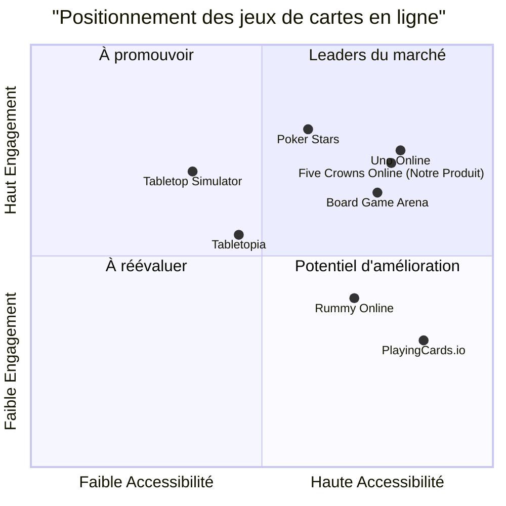
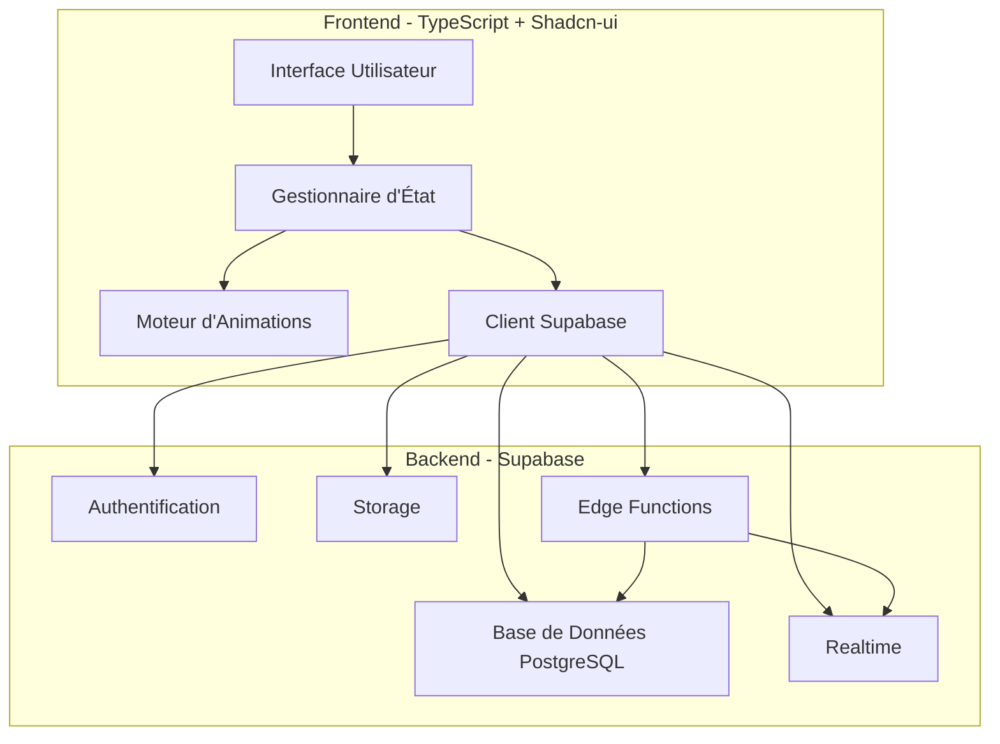
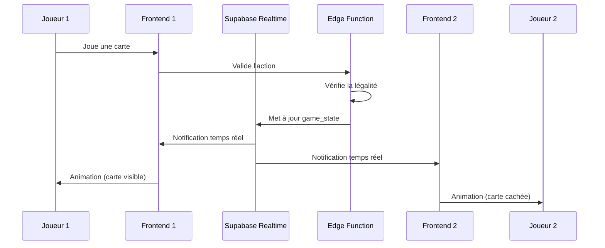

# Document de Spécifications Produit (PRD)
# Les Cinq Rois - Jeu en Ligne

## 1. Informations du Projet

### 1.1 Langue et Technologies
- **Langue du document** : Français
- **Langages de programmation** : TypeScript, Shadcn-ui, Tailwind CSS
- **Backend** : Supabase (base de données, authentification, temps réel)
- **Bibliothèques d'animation** : animate.css + animations personnalisées
- **Nom du projet** : five_crowns_online

### 1.2 Reformulation des Exigences Originales

Recréer le jeu de société "Les Cinq Rois" (Five Crowns) pour qu'il soit jouable en ligne avec les fonctionnalités suivantes :

- **Animations de cartes** : Animations fluides lors de la pioche et de la défausse, avec différentes perspectives pour le joueur actif et les autres joueurs
- **Menu principal** : 4 options (Lancer une partie, Rejoindre une partie, Reprendre une partie, Historique des parties)
- **Système de profil** : Pseudo, image de profil, et badges déblocables via des succès (30 badges minimum)
- **Lobby de jeu** : Configuration des parties avec système de "prêt", animations d'attente, et gestion des joueurs manquants
- **Gameplay** : Timer optionnel, options d'abandon/quitter, sauvegarde automatique des parties
- **Historique** : Statistiques complètes et fonction de rejeu des parties
- **Multijoueur** : Accessible via internet, une instance par joueur
- **Sécurité** : Protection contre la triche via l'inspecteur

## 2. Définition du Produit

### 2.1 Objectifs du Produit

1. **Recréer fidèlement l'expérience du jeu Five Crowns** : Implémenter toutes les règles du jeu de société original avec une interface intuitive et des animations engageantes
2. **Offrir une expérience multijoueur fluide et sécurisée** : Permettre aux joueurs de jouer ensemble via internet avec synchronisation en temps réel et protection contre la triche
3. **Créer un système de progression engageant** : Implémenter un système de badges et de succès pour encourager la rejouabilité et l'engagement des joueurs

### 2.2 User Stories

1. **En tant que joueur occasionnel**, je veux pouvoir créer rapidement une partie avec des IA pour jouer seul et apprendre les règles du jeu
2. **En tant que joueur compétitif**, je veux pouvoir voir mes statistiques détaillées et débloquer des badges pour montrer ma progression et mes accomplissements
3. **En tant qu'hôte de partie**, je veux pouvoir configurer facilement une partie multijoueur avec mes amis, gérer les paramètres, et lancer la partie quand tout le monde est prêt
4. **En tant que joueur en ligne**, je veux voir des animations fluides et claires lors des actions de jeu pour comprendre ce qui se passe et profiter d'une expérience immersive
5. **En tant que joueur occupé**, je veux pouvoir quitter une partie et la reprendre plus tard exactement où je l'ai laissée sans perdre ma progression

### 2.3 Analyse Concurrentielle

| Produit | Avantages | Inconvénients |
|---------|-----------|---------------|
| **Board Game Arena** | - Large bibliothèque de jeux<br>- Interface épurée<br>- Communauté active | - Pas de Five Crowns<br>- Animations limitées<br>- Système de badges basique |
| **Tabletopia** | - Graphismes 3D réalistes<br>- Nombreux jeux de société<br>- Mode sandbox | - Performances variables<br>- Courbe d'apprentissage élevée<br>- Pas de Five Crowns officiel |
| **Rummy Online** | - Gameplay similaire à Five Crowns<br>- Multijoueur fluide<br>- Application mobile | - Pas les règles exactes de Five Crowns<br>- Interface datée<br>- Peu d'animations |
| **PlayingCards.io** | - Très flexible<br>- Gratuit<br>- Facile à utiliser | - Pas de règles automatisées<br>- Pas d'animations<br>- Pas de système de progression |
| **Tabletop Simulator** | - Très personnalisable<br>- Physique réaliste<br>- Mods communautaires | - Nécessite achat<br>- Performances exigeantes<br>- Pas optimisé pour jeux de cartes |
| **Uno Online** | - Animations excellentes<br>- Multijoueur stable<br>- Interface moderne | - Un seul jeu<br>- Pas de système de rejeu<br>- Personnalisation limitée |
| **Poker Stars** | - Système de profil robuste<br>- Statistiques détaillées<br>- Sécurité éprouvée | - Orienté poker uniquement<br>- Interface complexe<br>- Monétisation agressive |

### 2.4 Graphique du Quadrant Concurrentiel



## 3. Spécifications Techniques

### 3.1 Analyse des Exigences

Le projet nécessite la création d'une application web complète avec les composants suivants :

**Frontend**
- Interface utilisateur responsive avec Shadcn-ui et Tailwind CSS
- Système d'animations complexes pour les cartes (pioche, défausse, mouvements)
- Gestion d'état en temps réel pour le multijoueur
- Système de routing pour les différentes vues (menu, lobby, jeu, historique)
- Protection contre l'inspection des données sensibles

**Backend (Supabase)**
- Base de données pour stocker : profils utilisateurs, parties, historique, statistiques, badges
- Authentification des joueurs (anonyme ou avec compte)
- Temps réel pour la synchronisation des parties multijoueurs
- Fonctions Edge pour la logique de jeu côté serveur (validation, IA, sécurité)
- Stockage pour les images de profil

**Logique de Jeu**
- Implémentation complète des règles de Five Crowns (11 manches, jokers variables, combinaisons)
- Système de scoring automatique
- IA pour les joueurs virtuels (plusieurs niveaux de difficulté)
- Validation côté serveur de toutes les actions
- Système de timer avec actions automatiques

**Système de Progression**
- 30 badges déblocables minimum
- Système de succès variés (victoires, actions spéciales, séries)
- Statistiques détaillées (parties jouées, gagnées, ratio de victoire)
- Historique complet des parties avec fonction de rejeu

### 3.2 Pool d'Exigences

#### P0 (Indispensable - Must Have)

**Règles du Jeu**
- [ ] Implémenter les 11 manches de Five Crowns (3 à 13 cartes)
- [ ] Gérer le joker variable par manche (3 pour la manche 1, 4 pour la manche 2, etc.)
- [ ] Implémenter les 5 couleurs (étoiles, cœurs, trèfles, piques, carreaux)
- [ ] Gérer les cartes de 3 à 13 + 3 jokers par couleur (116 cartes total)
- [ ] Valider les combinaisons (suites et brelans de 3+ cartes)
- [ ] Calculer le score automatiquement (cartes restantes = points négatifs)
- [ ] Déterminer le gagnant (score le plus bas après 11 manches)

**Menu Principal**
- [ ] Créer l'écran du menu principal avec 4 boutons
- [ ] Implémenter "Lancer une partie"
- [ ] Implémenter "Rejoindre une partie"
- [ ] Implémenter "Reprendre une partie" (uniquement parties avec IA)
- [ ] Implémenter "Historique des parties"

**Système de Profil**
- [ ] Permettre la configuration du pseudo (sauvegarde persistante)
- [ ] Permettre le téléchargement d'une image de profil (sauvegarde persistante)
- [ ] Créer le système de sélection de badges
- [ ] Implémenter 30 badges différents déblocables
- [ ] Créer le système de succès pour débloquer les badges

**Lobby de Jeu**
- [ ] Permettre la sélection du nombre de joueurs (2-8)
- [ ] Afficher la liste des joueurs (image, pseudo, badge sur une ligne)
- [ ] Implémenter le système de "prêt" pour tous les joueurs sauf l'hôte
- [ ] Animation de changement de couleur du pseudo (rouge ↔ vert, gauche vers droite)
- [ ] Activer le bouton "Lancer la partie" uniquement quand tous sont prêts
- [ ] Popup pour l'hôte si joueurs manquants (Annuler / Lancer avec IA)
- [ ] Permettre l'activation/désactivation du timer
- [ ] Afficher popup "Le joueur [pseudo] a rejoint la partie" en haut à droite

**Animations d'Attente**
- [ ] Implémenter animate__lightSpeedInLeft pour l'entrée
- [ ] Attente de 2,5 secondes
- [ ] Implémenter animate__hinge pour la sortie
- [ ] Boucler l'animation pour les joueurs manquants

**Animations des Cartes**
- [ ] Pioche (joueur actif) : carte part de la pioche → main du joueur + retournement
- [ ] Pioche (autres joueurs) : carte part de la pioche → zone du joueur (face cachée)
- [ ] Défausse (joueur actif) : carte va directement à la défausse (face visible)
- [ ] Défausse (autres joueurs) : carte va à la défausse + retournement (on ne voit pas la carte)

**Gameplay**
- [ ] Implémenter le système de timer par tour
- [ ] Action aléatoire automatique si le timer expire
- [ ] Option "Abandonner" (termine la partie)
- [ ] Option "Quitter" (sauvegarde la partie)
- [ ] Fonction de reprise de partie (même état exact)
- [ ] Limitation de la reprise aux parties avec IA uniquement

**Historique**
- [ ] Afficher la liste de toutes les parties effectuées
- [ ] Afficher le nombre total de parties jouées
- [ ] Afficher le nombre de victoires
- [ ] Calculer et afficher le ratio de victoire
- [ ] Fonction de rejeu des parties
- [ ] Contrôle manuel de la vitesse de lecture du rejeu

**Multijoueur**
- [ ] Permettre la connexion via internet (pas de restriction WiFi)
- [ ] Une instance = un joueur (pas de multi-joueurs sur une instance)
- [ ] Synchronisation en temps réel avec Supabase

**Sécurité**
- [ ] Empêcher la visualisation des cartes des autres via l'inspecteur
- [ ] Validation côté serveur de toutes les actions
- [ ] Chiffrement des données sensibles en transit
- [ ] Vérification de l'intégrité des actions de jeu

#### P1 (Important - Should Have)

**Système de Badges - Catégories de Succès**
- [ ] Badge "🏆 Premier Pas" : Terminer sa première partie
- [ ] Badge "🎯 Précision" : Gagner une partie avec moins de 50 points
- [ ] Badge "⚡ Rapide" : Gagner une partie en moins de 15 minutes
- [ ] Badge "🔥 Série" : Gagner 3 parties d'affilée
- [ ] Badge "💎 Perfection" : Terminer une manche avec 0 point
- [ ] Badge "🎲 Chanceux" : Piocher 5 jokers dans une partie
- [ ] Badge "🧠 Stratège" : Gagner sans utiliser de joker
- [ ] Badge "👑 Roi" : Gagner 10 parties
- [ ] Badge "🌟 Légende" : Gagner 50 parties
- [ ] Badge "💯 Centurion" : Gagner 100 parties
- [ ] Badge "🎪 Polyvalent" : Gagner avec tous les nombres de joueurs (2-8)
- [ ] Badge "⏱️ Contre la Montre" : Gagner 5 parties avec timer activé
- [ ] Badge "🎭 Comédien" : Jouer 100 parties (victoire ou défaite)
- [ ] Badge "🏅 Vétéran" : Jouer 500 parties
- [ ] Badge "📊 Analyste" : Consulter l'historique 50 fois
- [ ] Badge "🔄 Rejoueur" : Revoir 10 parties en entier
- [ ] Badge "🤖 Dompteur d'IA" : Gagner 20 parties contre des IA
- [ ] Badge "👥 Social" : Jouer 50 parties multijoueurs
- [ ] Badge "🎨 Personnalisé" : Changer son image de profil 5 fois
- [ ] Badge "🏃 Marathon" : Jouer 10 parties d'affilée
- [ ] Badge "🌙 Noctambule" : Jouer entre minuit et 6h du matin
- [ ] Badge "☀️ Matinal" : Jouer entre 6h et 9h du matin
- [ ] Badge "🎯 Sniper" : Gagner une manche en posant toutes ses cartes d'un coup
- [ ] Badge "🛡️ Défenseur" : Finir 2ème dans 20 parties
- [ ] Badge "🎁 Généreux" : Abandonner 5 parties
- [ ] Badge "💪 Persévérant" : Perdre 10 parties d'affilée puis gagner
- [ ] Badge "🎲 Collectionneur" : Débloquer 15 autres badges
- [ ] Badge "👑 Maître" : Débloquer tous les autres badges
- [ ] Badge "🚀 Pionnier" : Être parmi les 100 premiers joueurs
- [ ] Badge "🌍 Explorateur" : Jouer depuis 3 pays différents

**Interface Utilisateur**
- [ ] Animations de transition entre les écrans
- [ ] Effets sonores pour les actions importantes
- [ ] Musique de fond (désactivable)
- [ ] Mode sombre / clair
- [ ] Tutoriel interactif pour les nouveaux joueurs
- [ ] Indicateurs visuels pour les actions possibles
- [ ] Système de chat dans le lobby et pendant la partie
- [ ] Emojis réactifs pendant la partie

**Statistiques Avancées**
- [ ] Graphiques d'évolution des performances
- [ ] Statistiques par nombre de joueurs
- [ ] Temps de jeu total
- [ ] Carte la plus jouée
- [ ] Combinaison préférée
- [ ] Taux de victoire par manche

**IA**
- [ ] 3 niveaux de difficulté (Facile, Moyen, Difficile)
- [ ] IA avec personnalités différentes (agressif, défensif, équilibré)
- [ ] Temps de réflexion variable pour l'IA (plus réaliste)

#### P2 (Souhaitable - Nice to Have)

**Fonctionnalités Sociales**
- [ ] Système d'amis
- [ ] Invitations directes
- [ ] Classement global
- [ ] Tournois organisés
- [ ] Replays partagés publiquement

**Personnalisation Avancée**
- [ ] Thèmes de cartes personnalisables
- [ ] Fonds de table personnalisables
- [ ] Avatars animés
- [ ] Effets de particules pour les victoires

**Accessibilité**
- [ ] Support des lecteurs d'écran
- [ ] Mode daltonien
- [ ] Tailles de police ajustables
- [ ] Raccourcis clavier complets

**Performance**
- [ ] Mode hors ligne contre IA
- [ ] Optimisation pour connexions lentes
- [ ] Compression des données de rejeu

### 3.3 Maquette de l'Interface Utilisateur

#### Écran 1 : Menu Principal
```
┌─────────────────────────────────────────┐
│                                         │
│         LES CINQ ROIS                   │
│         [Logo du jeu]                   │
│                                         │
│    ┌─────────────────────────────┐     │
│    │   🎮 Lancer une partie      │     │
│    └─────────────────────────────┘     │
│                                         │
│    ┌─────────────────────────────┐     │
│    │   🔗 Rejoindre une partie   │     │
│    └─────────────────────────────┘     │
│                                         │
│    ┌─────────────────────────────┐     │
│    │   ⏸️  Reprendre une partie   │     │
│    └─────────────────────────────┘     │
│                                         │
│    ┌─────────────────────────────┐     │
│    │   📊 Historique             │     │
│    └─────────────────────────────┘     │
│                                         │
│              [⚙️ Profil]                │
└─────────────────────────────────────────┘
```

#### Écran 2 : Configuration du Profil
```
┌─────────────────────────────────────────┐
│  ← Retour          PROFIL               │
├─────────────────────────────────────────┤
│                                         │
│     [Photo de profil]                   │
│     [📷 Changer]                        │
│                                         │
│  Pseudo: [_____________]                │
│                                         │
│  Badge actuel: 🏆 Premier Pas           │
│  [Changer de badge ▼]                   │
│                                         │
│  ┌─────────────────────────────────┐   │
│  │ Badges débloqués (5/30)         │   │
│  │                                 │   │
│  │ 🏆 Premier Pas  ✓               │   │
│  │ 🎯 Précision    ✓               │   │
│  │ ⚡ Rapide       ✓               │   │
│  │ 🔥 Série        ✓               │   │
│  │ 💎 Perfection   ✓               │   │
│  │ 🎲 Chanceux     🔒              │   │
│  │ 🧠 Stratège     🔒              │   │
│  │ ...                             │   │
│  └─────────────────────────────────┘   │
│                                         │
│         [💾 Sauvegarder]                │
└─────────────────────────────────────────┘
```

#### Écran 3 : Lobby de Jeu (Hôte)
```
┌─────────────────────────────────────────┐
│  ← Retour      NOUVELLE PARTIE          │
├─────────────────────────────────────────┤
│                                         │
│  Nombre de joueurs: [▼ 4]              │
│  Timer: [☑️ Activé] Durée: [30s ▼]     │
│                                         │
│  ┌─────────────────────────────────┐   │
│  │ Joueurs (2/4)                   │   │
│  │                                 │   │
│  │ 👤 Alice 🏆 (Hôte)              │   │
│  │ 👤 Bob ⚡ (Prêt) ✓              │   │
│  │                                 │   │
│  │ [Animation d'attente...]        │   │
│  │ [Animation d'attente...]        │   │
│  └─────────────────────────────────┘   │
│                                         │
│  Code de la partie: ABC123              │
│  [📋 Copier le code]                    │
│                                         │
│     [🚀 Lancer la partie] (désactivé)   │
└─────────────────────────────────────────┘

Popup en haut à droite:
┌─────────────────────────┐
│ ✓ Bob a rejoint         │
└─────────────────────────┘
```

#### Écran 4 : Plateau de Jeu
```
┌─────────────────────────────────────────────────────────┐
│ ⏸️ Menu  Manche 3/11  Score: 45  ⏱️ 25s  [⚙️]          │
├─────────────────────────────────────────────────────────┤
│                                                         │
│  👤 Alice (45)    👤 Bob (52)    👤 Carol (38)         │
│  [3 cartes]      [3 cartes]     [3 cartes]            │
│                                                         │
│           [Pioche]        [Défausse: 7♠️]              │
│              🂠                                         │
│                                                         │
│  ┌─────────────────────────────────────────────────┐   │
│  │ Votre main:                                     │   │
│  │  3♥️  5♥️  7♥️  4♣️  9♦️  JOKER                   │   │
│  └─────────────────────────────────────────────────┘   │
│                                                         │
│  [Piocher] [Défausser] [Terminer la manche]            │
└─────────────────────────────────────────────────────────┘
```

#### Écran 5 : Historique des Parties
```
┌─────────────────────────────────────────┐
│  ← Retour      HISTORIQUE               │
├─────────────────────────────────────────┤
│                                         │
│  📊 Statistiques globales               │
│  ├─ Parties jouées: 127                 │
│  ├─ Victoires: 45                       │
│  └─ Ratio de victoire: 35.4%            │
│                                         │
│  ┌─────────────────────────────────┐   │
│  │ Parties récentes                │   │
│  │                                 │   │
│  │ 07/11/2025 - Victoire           │   │
│  │ 4 joueurs - 15:23 - 38 pts      │   │
│  │ [▶️ Revoir]                     │   │
│  │                                 │   │
│  │ 06/11/2025 - Défaite            │   │
│  │ 3 joueurs - 12:45 - 67 pts      │   │
│  │ [▶️ Revoir]                     │   │
│  │                                 │   │
│  │ 06/11/2025 - Victoire           │   │
│  │ 5 joueurs - 18:12 - 42 pts      │   │
│  │ [▶️ Revoir]                     │   │
│  │                                 │   │
│  │ ...                             │   │
│  └─────────────────────────────────┘   │
└─────────────────────────────────────────┘
```

#### Écran 6 : Rejeu de Partie
```
┌─────────────────────────────────────────────────────────┐
│ ← Retour  REJEU - Partie du 07/11/2025                  │
├─────────────────────────────────────────────────────────┤
│                                                         │
│  [État du jeu affiché comme pendant la partie]          │
│                                                         │
│  ┌─────────────────────────────────────────────────┐   │
│  │ ⏮️  ⏪  ⏯️  ⏩  ⏭️                                  │   │
│  │                                                 │   │
│  │ ━━━━━━━━━━●━━━━━━━━━━━━━━━━━━━━━━━━━━━━━━━━━  │   │
│  │ Manche 5/11 - Tour 23                           │   │
│  │                                                 │   │
│  │ Vitesse: [0.5x] [1x] [2x] [5x]                 │   │
│  └─────────────────────────────────────────────────┘   │
└─────────────────────────────────────────────────────────┘
```

### 3.4 Questions Ouvertes

1. **Authentification** : Doit-on permettre le jeu en mode anonyme ou exiger une authentification ? Recommandation : Permettre les deux (anonyme pour essai, compte pour sauvegarde)

2. **Monétisation** : Le jeu sera-t-il entièrement gratuit ou avec des options payantes ? Recommandation : Gratuit avec possibilité de cosmétiques payants

3. **Limites de parties simultanées** : Combien de parties un joueur peut-il avoir en cours ? Recommandation : 5 parties maximum en simultané

4. **Durée de conservation** : Combien de temps conserver les parties sauvegardées inactives ? Recommandation : 30 jours

5. **Taille maximale des images de profil** : Quelle limite imposer ? Recommandation : 2 MB maximum, 500x500 pixels

6. **Niveau de difficulté par défaut de l'IA** : Quel niveau choisir ? Recommandation : Moyen

7. **Durée par défaut du timer** : Quelle durée optimale ? Recommandation : 30 secondes

8. **Langue de l'interface** : Multilingue ou français uniquement ? Recommandation : Français en priorité, anglais en option

9. **Notifications** : Push notifications pour les tours des joueurs ? Recommandation : Oui, avec option de désactivation

10. **Classement** : Global ou par groupes d'amis ? Recommandation : Les deux options

## 4. Architecture Technique

### 4.1 Architecture Système



### 4.2 Modèle de Données (Supabase)

#### Table: profiles
```sql
- id (uuid, PK)
- username (text, unique)
- avatar_url (text)
- current_badge_id (uuid, FK)
- created_at (timestamp)
- updated_at (timestamp)
```

#### Table: badges
```sql
- id (uuid, PK)
- emoji (text)
- title (text)
- description (text)
- requirement_type (text)
- requirement_value (integer)
```

#### Table: user_badges
```sql
- id (uuid, PK)
- user_id (uuid, FK)
- badge_id (uuid, FK)
- unlocked_at (timestamp)
```

#### Table: games
```sql
- id (uuid, PK)
- code (text, unique)
- host_id (uuid, FK)
- max_players (integer)
- timer_enabled (boolean)
- timer_duration (integer)
- status (text) // 'waiting', 'in_progress', 'completed', 'abandoned'
- current_round (integer)
- created_at (timestamp)
- started_at (timestamp)
- completed_at (timestamp)
```

#### Table: game_players
```sql
- id (uuid, PK)
- game_id (uuid, FK)
- player_id (uuid, FK)
- player_order (integer)
- is_ai (boolean)
- is_ready (boolean)
- score (integer)
- status (text) // 'active', 'abandoned', 'disconnected'
```

#### Table: game_states
```sql
- id (uuid, PK)
- game_id (uuid, FK)
- round_number (integer)
- current_player_id (uuid, FK)
- deck (jsonb) // cartes restantes
- discard_pile (jsonb)
- player_hands (jsonb) // mains de tous les joueurs
- created_at (timestamp)
```

#### Table: game_actions
```sql
- id (uuid, PK)
- game_id (uuid, FK)
- player_id (uuid, FK)
- action_type (text) // 'draw', 'discard', 'finish_round'
- action_data (jsonb)
- timestamp (timestamp)
```

#### Table: game_history
```sql
- id (uuid, PK)
- game_id (uuid, FK)
- winner_id (uuid, FK)
- players_data (jsonb)
- final_scores (jsonb)
- duration (integer) // en secondes
- completed_at (timestamp)
```

#### Table: statistics
```sql
- id (uuid, PK)
- user_id (uuid, FK)
- total_games (integer)
- total_wins (integer)
- win_rate (decimal)
- total_playtime (integer) // en secondes
- updated_at (timestamp)
```

### 4.3 Flux de Données en Temps Réel



### 4.4 Sécurité et Prévention de la Triche

**Mesures côté Frontend**
1. Obfuscation du code JavaScript
2. Pas de stockage de données sensibles dans le localStorage
3. Validation des entrées utilisateur
4. Désactivation du clic droit et des outils de développement en production (optionnel)

**Mesures côté Backend**
1. Toutes les actions de jeu validées par Edge Functions
2. Les mains des joueurs stockées chiffrées
3. Vérification de l'ordre des tours
4. Détection des actions impossibles (ex: jouer une carte qu'on n'a pas)
5. Rate limiting sur les actions
6. Logs de toutes les actions pour audit

**Exemple de validation côté serveur**
```typescript
// Edge Function: validate-action
export async function validateAction(gameId, playerId, action) {
  // 1. Vérifier que c'est le tour du joueur
  const gameState = await getGameState(gameId);
  if (gameState.current_player_id !== playerId) {
    throw new Error("Not your turn");
  }
  
  // 2. Vérifier que l'action est légale
  const playerHand = decryptHand(gameState.player_hands[playerId]);
  if (action.type === 'discard' && !playerHand.includes(action.card)) {
    throw new Error("Card not in hand");
  }
  
  // 3. Appliquer l'action
  const newState = applyAction(gameState, action);
  await saveGameState(newState);
  
  // 4. Notifier tous les joueurs via Realtime
  await notifyPlayers(gameId, action);
}
```

## 5. Plan de Développement

### 5.1 Phase 1 : Fondations (Semaines 1-2)
- Configuration du projet (TypeScript, Shadcn-ui, Tailwind CSS)
- Configuration Supabase (base de données, authentification)
- Création du menu principal
- Système de profil basique (pseudo, image)

### 5.2 Phase 2 : Logique de Jeu (Semaines 3-5)
- Implémentation des règles de Five Crowns
- Système de validation des combinaisons
- Calcul automatique des scores
- IA basique (niveau moyen)

### 5.3 Phase 3 : Multijoueur (Semaines 6-8)
- Système de lobby
- Synchronisation en temps réel
- Gestion des tours
- Système de timer

### 5.4 Phase 4 : Animations (Semaines 9-10)
- Animations de cartes (pioche, défausse)
- Animations du lobby
- Transitions entre écrans
- Effets visuels

### 5.5 Phase 5 : Progression (Semaines 11-12)
- Système de badges (30 badges)
- Système de succès
- Historique des parties
- Fonction de rejeu

### 5.6 Phase 6 : Sécurité et Optimisation (Semaines 13-14)
- Validation côté serveur
- Protection anti-triche
- Optimisation des performances
- Tests de charge

### 5.7 Phase 7 : Polish et Tests (Semaines 15-16)
- Tests utilisateurs
- Corrections de bugs
- Amélioration de l'UX
- Documentation

## 6. Métriques de Succès

### 6.1 Métriques Techniques
- Temps de chargement initial < 3 secondes
- Latence des actions en temps réel < 200ms
- Taux d'erreur < 0.1%
- Disponibilité du service > 99.5%

### 6.2 Métriques Utilisateur
- Taux de rétention à 7 jours > 40%
- Durée moyenne de session > 20 minutes
- Nombre de parties par utilisateur actif > 5/semaine
- Taux de complétion des parties > 85%

### 6.3 Métriques d'Engagement
- Taux de déblocage de badges > 60% (au moins 1 badge)
- Taux de consultation de l'historique > 30%
- Taux d'utilisation du rejeu > 15%
- Taux de parties multijoueurs vs IA > 50%

## 7. Risques et Mitigation

### 7.1 Risques Techniques

| Risque | Impact | Probabilité | Mitigation |
|--------|--------|-------------|------------|
| Latence réseau élevée | Élevé | Moyen | Optimisation des requêtes, mise en cache, feedback visuel |
| Problèmes de synchronisation | Élevé | Moyen | Tests rigoureux, système de réconciliation |
| Triche via inspecteur | Élevé | Élevé | Validation serveur, chiffrement, obfuscation |
| Surcharge serveur | Moyen | Faible | Auto-scaling Supabase, optimisation des requêtes |
| Bugs dans la logique de jeu | Élevé | Moyen | Tests unitaires exhaustifs, beta testing |

### 7.2 Risques Produit

| Risque | Impact | Probabilité | Mitigation |
|--------|--------|-------------|------------|
| Complexité pour nouveaux joueurs | Moyen | Élevé | Tutoriel interactif, mode pratique |
| Manque d'engagement long terme | Élevé | Moyen | Système de badges, tournois, mises à jour régulières |
| Temps d'attente pour parties multijoueurs | Moyen | Moyen | IA pour compléter, matchmaking intelligent |
| Abandon de parties | Moyen | Élevé | Pénalités légères, système de sauvegarde |

## 8. Annexes

### 8.1 Règles Complètes de Five Crowns

**Matériel**
- 116 cartes : 5 couleurs (étoiles, cœurs, trèfles, piques, carreaux)
- Chaque couleur contient : cartes de 3 à 13 + 3 jokers
- Total : 58 cartes de chaque couleur (11 valeurs + 3 jokers) × 2 jeux = 116 cartes

**Déroulement**
- 11 manches (de 3 à 13 cartes distribuées)
- Manche 1 : 3 cartes, Manche 2 : 4 cartes, ..., Manche 11 : 13 cartes
- Le joker variable change à chaque manche (3 pour manche 1, 4 pour manche 2, etc.)

**Tour de jeu**
1. Piocher une carte (pioche ou défausse)
2. Défausser une carte
3. Si le joueur peut poser toutes ses cartes en combinaisons valides, il peut terminer la manche

**Combinaisons valides**
- **Suite** : 3+ cartes consécutives de la même couleur (ex: 3♥️ 4♥️ 5♥️)
- **Brelan** : 3+ cartes de même valeur, couleurs différentes (ex: 7♥️ 7♠️ 7♣️)
- Les jokers (fixes et variables) peuvent remplacer n'importe quelle carte

**Fin de manche**
- Quand un joueur termine, les autres ont un dernier tour
- Chaque carte restante = points négatifs (valeur de la carte)
- Jokers = 20 points

**Fin de partie**
- Après 11 manches, le joueur avec le score le plus bas gagne

### 8.2 Glossaire

- **IA** : Intelligence Artificielle, joueur contrôlé par l'ordinateur
- **Lobby** : Salle d'attente avant le début d'une partie
- **Hôte** : Joueur qui crée et configure la partie
- **Timer** : Compte à rebours limitant le temps de jeu par tour
- **Badge** : Récompense visuelle déblocable via des succès
- **Succès** : Objectif à accomplir pour débloquer un badge
- **Rejeu** : Fonctionnalité permettant de revoir une partie terminée
- **Edge Function** : Fonction serverless exécutée sur Supabase
- **Realtime** : Technologie de synchronisation en temps réel de Supabase

### 8.3 Références

- Documentation Supabase : https://supabase.com/docs
- Shadcn-ui : https://ui.shadcn.com/
- Animate.css : https://animate.style/
- Règles officielles Five Crowns : https://cdn.1j1ju.com/medias/b3/19/ed-five-crowns-rulebook.pdf

---

**Document créé le** : 07/11/2025  
**Version** : 1.0  
**Auteur** : Emma, Product Manager  
**Statut** : A mettre à jour